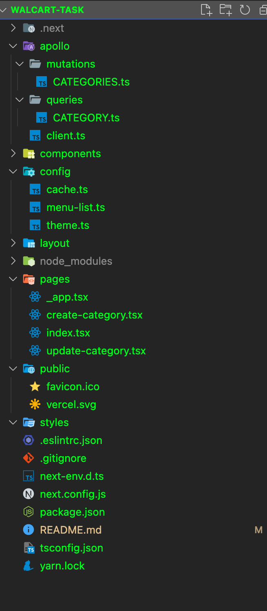

# Run cmd
***Run dev server***
```
npm run dev
or
yarn run dev

```
***build application***
```
npm run build
```

# Folder Structure



# Used Tools
1. React
2. Next
3. Typescript
4. GraphQL
5. Redux-Toolkit
6. Git (for version control and code sharing)